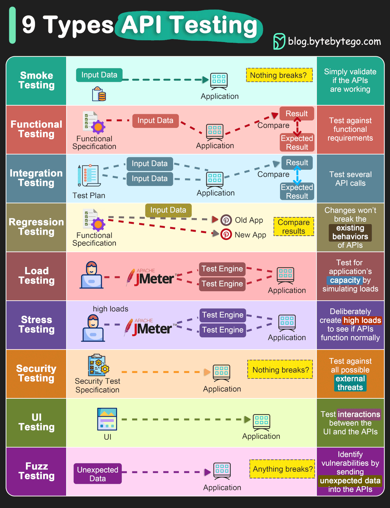

# Quality Assurance & Testing 🪳

## Introduction
In the world of software development, ensuring that your application functions as intended is not just beneficial—it's crucial. Quality Assurance (QA) and Testing are the safeguards that help maintain the integrity, performance, and reliability of your application.


[Source](https://blog.bytebytego.com/p/ep83-explaining-9-types-of-api-testing)

## Writing Unit Tests
Ruby on Rails comes with a [built-in testing suite]((https://guides.rubyonrails.org/testing.html)) that you can leverage to test your models, controllers, and more. [RSpec](https://rspec.info/) is a popular alternative that provides a more expressive syntax and additional features.

Example of a Simple Test with RSpec
```ruby
RSpec.describe User, type: :model do
  it 'is valid with valid attributes' do
    user = User.new(name: 'Alice', email: 'alice@example.com')
    expect(user).to be_valid
  end
end
```

## Tracking and Managing Exceptions
When your app is live, tracking exceptions is vital. Services like [Airbrake](https://github.com/airbrake/airbrake) and [Rollbar](https://github.com/rollbar/rollbar-gem) can be integrated into your Rails application. These tools help by:

- **Catching Exceptions**: They catch and log errors that occur in real-time.
- **Notification**: You get notified immediately when something goes wrong.
- **Debugging Assistance**: They provide detailed reports and contexts, helping you track down issues quickly.

## Functional Specifications
Creating a Functional Specification document is critical. It guides both developers and QA teams on what needs to be tested and assures that all features work as intended. This document should detail:

- **User Stories**: What the user can do with the application.
- **Expected Behaviors**: How the application should behave under various conditions.
- **Edge Cases**: Special cases or unusual conditions that need handling.

## Performance Testing
Ensure your application performs well under stress and high traffic by using tools like:

- [New Relic](https://newrelic.com/): Monitors and tunes the performance of your application.
- [JMeter](https://jmeter.apache.org/): Tests performance both on static and dynamic resources.

## Conclusion
Quality Assurance and Testing are not afterthoughts but integral parts of the development process. By implementing thorough testing and integration procedures, you can ensure that your applications are reliable, robust, and ready for anything that comes their way.

Remember, "An ounce of prevention is worth a pound of cure." Happy testing! 🚀
